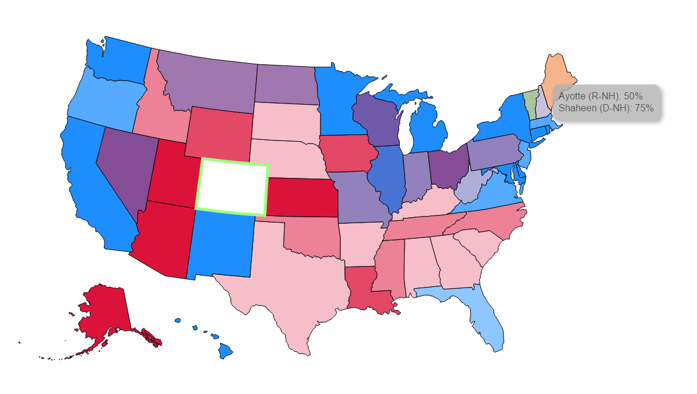

# PoliVis: Congressional Political Relationships

*By Curtis Miller and Jignesh Rawal*



## Code  
We started from an HTML5 Boilerplate template. Most code for the website is in the **src** directory. Our own code is included in:

	* index.html
	* src/congress.js
	* src/main.js
	* src/mapVis.js
	* src/scatterVis.js
	* data/Senate114Metadata.json
	* data/SenateRecord114.json
	* css/main.css
	* CS6630ReadData-12-2-15.r (not actually used by the vis, but used for data preprocessing)

The rest, save for map_test.html and scatterplot_test.html and the favicon, are provided by HTML5 Boilerplate.

## Installation  
```shell
cd /path/to/apacheServer #Usually /var/www/html in Linux/Unix 
git clone https://github.com/ntguardian/dataviscourse-pr-congressrelations
npm install #Install nodejs or npm to install dependencies.
```

## Process Book  
See CS6630ProjectNotebook.pdf for the process book.

## Live Demo  
You can find the live website [here](http://ntguardian.github.io).

## Usage

A Youtube demonstration is available [here](https://www.youtube.com/watch?v=wa0vqh6O1Qw).

### Scatterplot
The scatterplot shows Senate representatives for each state.  Democrats are colored blue, Republicans are red, and other parties are colored as yellow. 
On the X axis each senator is placed by their Ideology. The range starts with most liberal, and ends with most conservative. 
The Y axis shows how often the selected senator or senators voted with each other senator.

### Map
The map allow a user to select the senators of that state, and adjusts the scatterplot according to the selected state.

### Selection tool
The selection tool allows users to search for senators, clear the current selection, toggles whether selecting a senator adds to the current selection, or overrides the current selection.